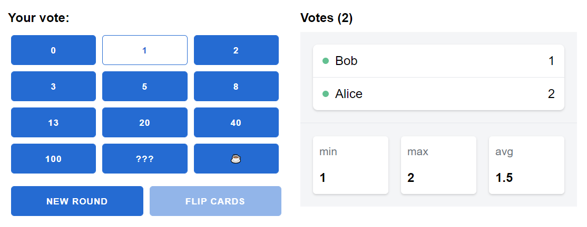

# Gaga

Gaga is an online simple planning poker app built in [Elixir][urls.elixir],
using [Phoenix][urls.phoenix] and [LiveView][urls.live-view].

It's free, open source, and doesn't require signing up nor store any data about
you or your team (it doesn't even have a DB).

You can try it live on https://gaga.labvoid.com.

## ❓ Why?

Most of us are working from home due to the coronavirus outbreak.

While many tools already exist to keep us connected through video conferencing,
we also needed a simple collaborative app that makes it easy to estimate and
plan iterations while working remotely.

As it might help other teams and doesn't consume many resources, we decided to
make it available for everyone.

## 🤝 Contributing

Whether you're helping us fix bugs, improve the docs, or spread the word, we'd
love to have you as part of the community!

Check out our [Contributing Guide](./CONTRIBUTING.md) for ideas on contributing
and setup steps for getting the repository up and running on your local machine.

## ❗ Code of Conduct

We are dedicated to building a welcoming, diverse, safe community. We expect
everyone participating in the project to abide by our Code of Conduct. Please
read it. Please follow it.

## 👩‍💻 Development

* [**Setup**](./CONTRIBUTING.md#setup)
* [**Getting started**](./CONTRIBUTING.md#getting-started)

## 🔎 The Little Details

* **[The LiveView integration](./lib/gaga_web/live/game_live.ex)** -
  [LiveView][urls.live-view.behaviour], [PubSub][urls.phoenix.pubsub],
  [Presence][urls.phoenix.presence] and player state.
* **[The Game view](./lib/gaga_web/views/game_view.ex)** -
  [View][urls.phoenix.view] layer defining UI helpers.
* **[The UI](./lib/gaga_web/templates/game/show.html.leex)** -
  Live View [Bindings][urls.live-view.bindings].

## 📝 License

This project is licensed under the [MIT License](./LICENSE).

## Note

We made this app in half a day, so it may still have some rough edges 😅.

---

  Developed with ❤️ by <strong><a href="https://madvoid.com">Madvoid</a></strong>.

[urls.elixir]: https://elixir-lang.org/
[urls.phoenix]: https://www.phoenixframework.org/
[urls.live-view]: https://github.com/phoenixframework/phoenix_live_view

[urls.live-view.behaviour]: https://hexdocs.pm/phoenix_live_view/Phoenix.LiveView.html
[urls.live-view.bindings]: https://hexdocs.pm/phoenix_live_view/Phoenix.LiveView.html#module-bindings
[urls.phoenix.presence]: https://hexdocs.pm/phoenix/Phoenix.Presence.html
[urls.phoenix.pubsub]: https://hexdocs.pm/phoenix_pubsub/Phoenix.PubSub.html
[urls.phoenix.view]: https://hexdocs.pm/phoenix/Phoenix.View.html
